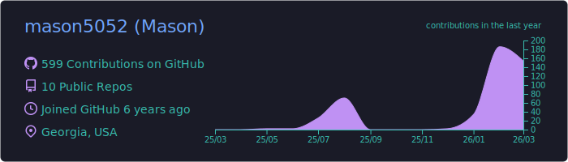
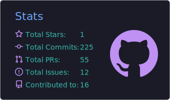
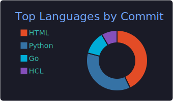

# Mason Kim

**Security Engineer** | Platform security, adversarial defense, and attack chain research

---

## What I Build

Security tools for adversarial eCommerce environments. I build detection systems, WAF automation, and compliance tooling -- solving real operational problems with open-source code.

- Currently building: [Commerce Abuse Defense v0.3](https://github.com/mason5052/commerce-abuse-defense) -- ML-based anomaly detection for bot scoring

---

## Featured Projects

| Project | Description | Stack |
|---------|-------------|-------|
| [Commerce Abuse Defense](https://github.com/mason5052/commerce-abuse-defense) | Bot abuse detection and scoring tool with WAF rule generation. 6 detection rules, weighted scoring (0-100), auto-generates Cloudflare and AWS WAF rules. v0.2.1, 60 tests, CI. | Python, Shopify, Cloudflare, AWS WAF |
| [K8s Security Baseline](https://github.com/mason5052/k8s-security-baseline) | CIS Benchmark v1.8.0 audit automation with RBAC templates, network policies, and SOC 2 control mapping. | Bash, Python, Kubernetes |
| [AWS WAF Security Framework](https://github.com/mason5052/aws-waf-security-framework) | Production Terraform WAF modules for eCommerce. Bot Control, IP Reputation, Rate Limiting, Geo Blocking. Reduced bot traffic from 30%+ to under 3%. | Terraform, AWS WAF, CloudWatch |

---

## Research

Published attack chain analyses documenting real-world eCommerce attack patterns:

- **[001: Hidden Product Card-Testing on Shopify](https://github.com/mason5052/commerce-abuse-defense/blob/main/docs/attack-chains/001-hidden-product-card-testing.md)** -- How attackers discover $0 products via API enumeration and use them for card validation. MITRE ATT&CK T1595, T1190.
- **[002: App-Layer Bot Defense Bypass Patterns](https://github.com/mason5052/commerce-abuse-defense/blob/main/docs/attack-chains/002-app-layer-defense-bypass.md)** -- Why client-side bot mitigation is necessary but insufficient. 5 bypass techniques, multi-layer defense architecture.

---

## Certifications

| Certification | Issuer | Valid |
|---------------|--------|-------|
| Certified Ethical Hacker (CEH) | EC-Council | 2025-2028 |
| Terraform Associate (004) | HashiCorp | Current |
| CASE Java (Application Security) | EC-Council | 2024-2027 |

## Education

| Degree | Institution | Status |
|--------|-------------|--------|
| MS Cybersecurity | Georgia Institute of Technology | Expected 2026 |

---

## Tech Stack

---

## GitHub Stats

  

  
  

